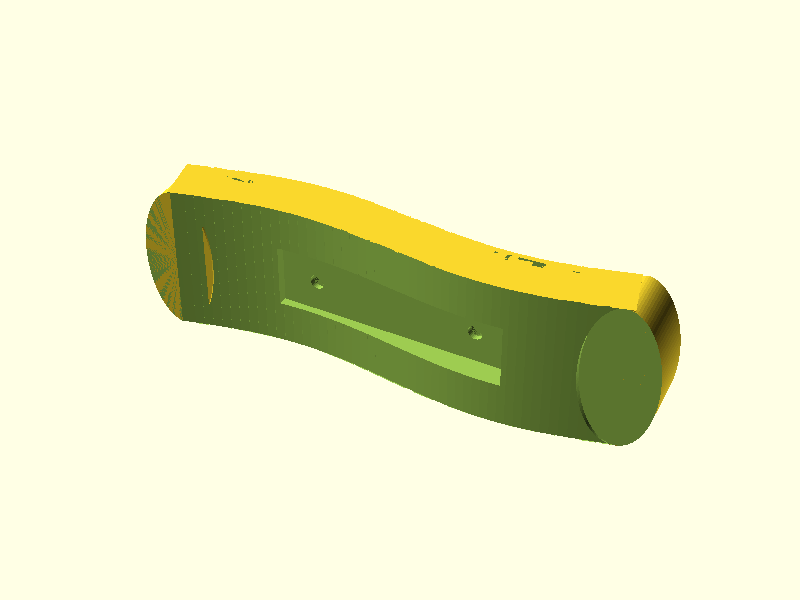
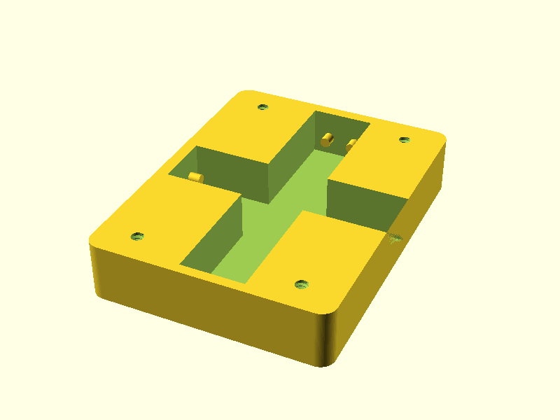
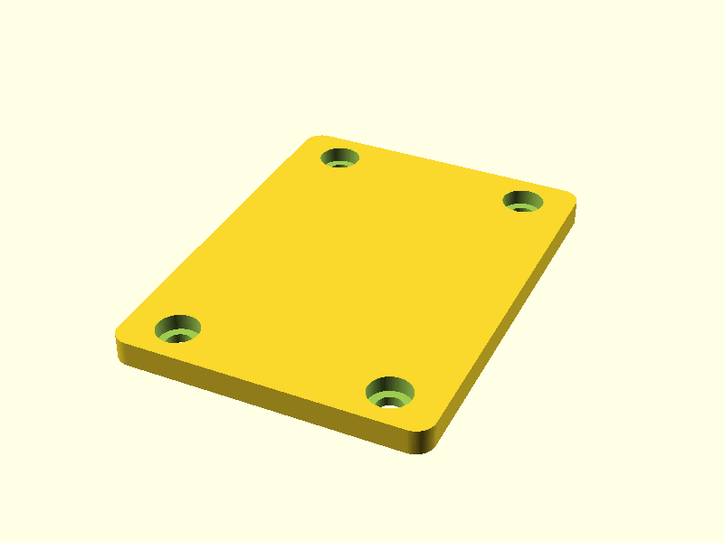
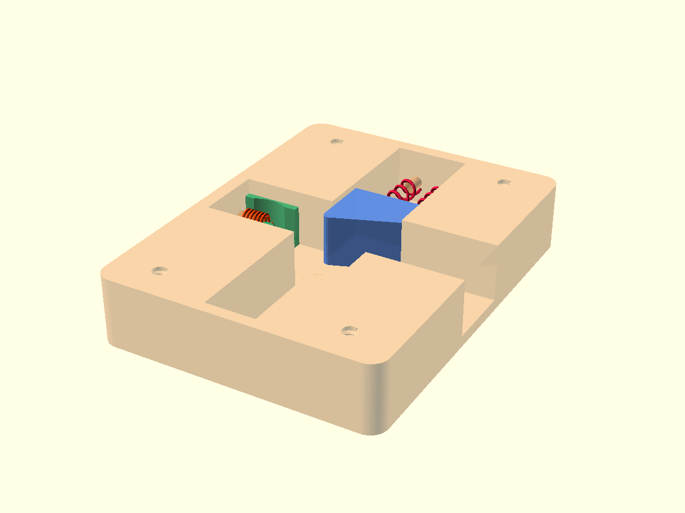

# QuadBrace — 3D-Printable Assistive Tool Holder for Quadriplegics

A set of parametric OpenSCAD models that together form a wrist-worn assistive device, allowing individuals with quadriplegia (tetraplegia) to independently pick up and use everyday tools such as forks, knives, and other utensils.

## Preview

| Wrist Brace | Main Box | Top Plate |
|:-----------:|:--------:|:---------:|
|  |  |  |

### Assembly — sliders and springs

*Blue — Y-groove slider (wide end toward sealed wall). Green — X-groove spring slider (at closed end). Red/orange coils — the two springs per slot connecting each slider's pegs to the end-wall pegs.*

## Purpose

People living with quadriplegia often have limited or no hand/finger function, making it difficult or impossible to grip tools unaided. This device provides a spring-loaded, quick-release mounting system that attaches to the wrist and holds tools securely while allowing easy release — restoring a degree of independence for feeding and other daily tasks.

## How It Works

The assembly consists of four main functional layers:

1. **Wrist Brace** (`wristbrace.scad`) — A curved, sine-wave-contoured band that conforms to the wrist. Strap slots allow it to be secured with hook-and-loop (Velcro) straps. A rectangular cutout in the brace receives the Main Box.

2. **Main Box** (`MainBox.scad` + `Top.scad`) — A compact rectangular housing that mounts into the brace. It contains two orthogonal sliding grooves (one along the wrist, one across it) with spring pegs at each sealed end. A thin top plate caps the assembly.

3. **Slider / Pusher** (`Slider.scad`, `TopSpringSlider.scad`, `pusher2.scad`) — A slider block sits inside the groove and is held in place by spring pegs. Pressing a pusher lever releases the slider, which then carries the tool holder outward for easy access, then snaps back when released.

4. **Tool Holder** (`holder.scad`) — A cylindrical clamp that grips the shaft of a fork, knife, spoon, or similar tool. Slotted for quick swap of tools; tightened with a single screw. A matching **rest/cradle** (`fork_rest`) provides a surface to park the tool when the brace is removed.

## Files

| File | Description |
|------|-------------|
| `common_params.scad` | Shared dimensions and fit parameters for the Main Box assembly |
| `params_quadbrace.scad` | Shared parameters for the pusher, sleeve, slider, and wrist brace |
| `geom_helpers.scad` | Reusable geometry modules (rounded prisms, screw holes, spring pegs) |
| `MainBox.scad` | Main mounting box with cross-shaped grooves and spring pegs |
| `Top.scad` | Thin top plate with counterbored screw holes |
| `wristbrace.scad` | Sine-contoured wrist band with strap cutouts and box slot |
| `holder.scad` | Cylindrical tool clamp + flat rest/cradle |
| `pusher2.scad` | Pusher stem, shell sleeve, and end-cap release mechanism |
| `Slider.scad` | Slider block that travels in the Main Box grooves |
| `TopSpringSlider.scad` | Spring-loaded top slider variant |
| `pyramid.scad` | Pyramid/ramp geometry for slider leading edge |
| `key.scad` | Anti-rotation key geometry |
| `PrintAll.scad` | Print any combination of parts on one bed; set `print_all = true` or flip individual flags |
| `AssemblyPreview.scad` | Exploded assembly preview (all parts together) |

## Requirements

- [OpenSCAD](https://openscad.org/) 2021.01 or later
- [BOSL2 library](https://github.com/BelfrySCAD/BOSL2) — place the `BOSL2/` folder in your OpenSCAD library path

## Printing

All parts are designed for FDM printing (PLA or PETG recommended). No supports are required for most parts. Suggested settings:

- Layer height: 0.2 mm
- Infill: 30–40%
- Perimeters: 3+
- Hardware: M3 or #6/#8 machine screws (see parameter files for exact sizes)

## Customisation

All critical dimensions are centralised in `common_params.scad` and `params_quadbrace.scad`. Adjust wrist width, tool diameter, groove clearances, and peg sizes to match the user's anatomy and chosen hardware before slicing.

## License

Released under the [Creative Commons Attribution 4.0 International (CC BY 4.0)](https://creativecommons.org/licenses/by/4.0/) licence. You are free to print, modify, and share this design — attribution appreciated.

## Contributing

Pull requests and issue reports are welcome. If you adapt this design for a specific tool or user need, please share your fork so others can benefit.
